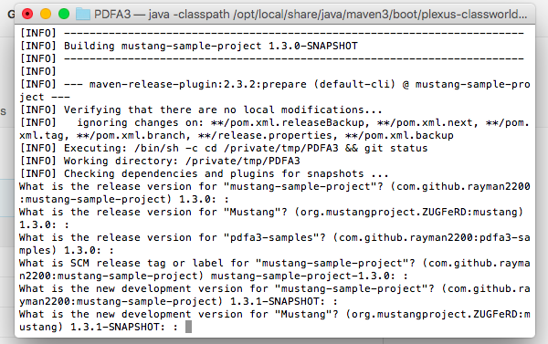

## New build

Target platform is java 1.7

## Build

Toecount is now part of the package which can be build with
```
mvn clean package
```

## Test

`package -Dmaven.surefire.debug="-Xdebug -Xrunjdwp:transport=dt_socket,server=y,suspend=y,address=8001 -Xnoagent -Djava.compiler=NONE"`
can be used as debug configuration goal in Eclipse. In that case you can set breakpoints in tests.

## Validate

[ZUV](https://github.com/ZUGFeRD/ZUV/) can be used to validate generated files.

## Deployment

A section in Maven's settings.xml is needed, in Linux (and MacOS) that's at ~/.m2/settings.xml 

As „servers“, enter the following
```xml
   <servers> 
    <server> 
      <id>github</id> 
      <password>GITHUB-TOKEN</password> 
    </server> 
   </servers> 
```
The whole settings.xml then looks e.g. like this
```xml
<settings xmlns="http://maven.apache.org/SETTINGS/1.0.0"
      xmlns:xsi="http://www.w3.org/2001/XMLSchema-instance"
      xsi:schemaLocation="http://maven.apache.org/SETTINGS/1.0.0
                          https://maven.apache.org/xsd/settings-1.0.0.xsd">
      <localRepository/>
      <interactiveMode/>
      <usePluginRegistry/>
      <offline/>
      <pluginGroups/>
      <servers>
        <server> 
      	<id>github</id> 
      	<password>TOKEN</password> 
        </server> 
      </servers>
      <mirrors/>
      <proxies/>
      <profiles/>
      <activeProfiles/>
</settings>
```

The password is generated on github.
See the following screenshot:


Sign in in GitHub and click on the profile picture -> Settings. Now just generate a new token and set the checkboxes from the screenshot.

 The Token-ID is the password. 


## Release

You will need a git client on the console, if that's available can e.g. be checked with "git --version" . 
Change to the root of the repo.

Change to the project directory and run 
  * `mvn clean install` . If that works you can 
  * clean the release with `mvn release:clean` and prepare the release with
  * `mvn release:prepare  -DignoreSnapshots=true` and enter the version numbers. 
  * After that is through you can create a new release via `mvn release:perform`.This will also update the maven repo. 
  
  
  

Afterwards you can access the release page and update the documentation, e.g. upload the jar, the jar javadoc and ZugferdDev. You can also enter a changelog and a better title. 


## Release process

  * Update documentation
  * write/translate announcement
  * release via/for mvn
  * Publish a github release
  * update mustangproject.org RE
    * version number and release date
    * sample file?
    * Deployment jar
  * put announcement on usegroup
  * email the mailing list
  * freshcode.club
 