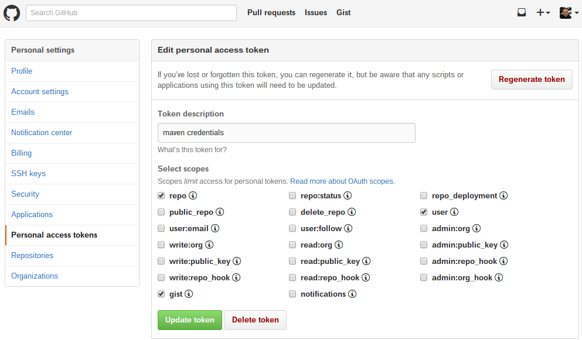

## Typical process

1. build

To check if the necessary tools are there, the build is in a stable state and works on your platform, e.g. download and extract https://github.com/ZUGFeRD/mustangproject/archive/master.zip and run ./mvnw clean package

Mvnw is a maven wrapper which will download maven.Maven is the dependency management tool which will download all libraries, their dependencies, and build the whole thing.
Mvnw is a maven wrapper which will download maven.Maven is the dependency management tool which will download all libraries, their dependencies, and build the whole thing.

You will need a Java JDK, e.g. https://www.azul.com/downloads/zulu-community/?architecture=x86-64-bit&package=jdk

If that does not work feel free to address the community support mailing list with error messages/steps to reproduce.

You may already start developing what you wanted. Of course you can use any editor or IDE you like, I suggest Intellij Community Edition https://www.jetbrains.com/de-de/idea/download/


2. fork

Once you can build, the idea is that you contribute patches via pull requests. For this you need a GitHub account and  a personal copy of the repository to store your changes in. Just click fork on the mustangproject. On your copy you will have git write access. My suggestion as git client is sourcetree.
There is a documentation [how to create pull requests from forks to the original repo](https://docs.github.com/de/pull-requests/collaborating-with-pull-requests/proposing-changes-to-your-work-with-pull-requests/creating-a-pull-request-from-a-fork).  

3. branch

If you do a pull request, please do a feature branch, e.g. if you are working on a feature abc you could call your branch feature_abc. Merge requests unfortunately don't work if you don't have a branch you request merge of. Technically we follow the "GitHub flow" strategy (not to be exchanged with the more sophisticated "git flow" strategy)

4. test

Most of mustang is a library, adding (autmated junit) test cases is often not only the most sustainable but also the fastest way to see if new/changed functionality works. If something is changed so that old test cases break on purpose please do not just remove them but take the time to fix the test cases


## Typical workflow

If e.g. new elements or attributes are added, they are often added
* in the object so that a developer can use them
* in the interface so that a old fashioned developer could use them as well
* in the pullprovider so that it actually finds it's way into the XML
* in at least one test, after the test has been run this should at least once be 
* validated. If that works one can start implementing the 
* reading part (along with tests), then it needs to be
* documented e.g. on the homepage and 
* communicated, at the very least by mentioning it in the history.md

## Architecture

Mustang contains a library to read/write e-invoices, 
a validator library  
(and can also read/write e-invoices, but is substantially 
larger) and a commandline application using the latter 
library.


The validator component embeds VeraPDF, an open-source
PDF/A-validator, via maven dependency and uses standard java
checks against schema and ph-schematron for checks against the schematron
to validate the XML part of the invoices.


## New build

Target platform is java 1.8

## Build

The package can be build with
```
mvnw clean package
```

In case you also want to generate  XSLT files from new schematron files for the validator please run the profile "generateXSLTFromSchematron"
(which takes around 20min on my machine)

```
mvnw clean package -P generateXSLTFromSchematron
```

## Test

`package -Dmaven.surefire.debug="-Xdebug -Xrunjdwp:transport=dt_socket,server=y,suspend=y,address=8001 -Xnoagent -Djava.compiler=NONE"`
can be used as debug configuration goal in Eclipse. In that case you can set breakpoints in tests.


## Deployment

A section in Maven's settings.xml is needed, in Linux (and MacOS) that's at ~/.m2/settings.xml 

As „servers“, enter the following
```xml
   <servers> 
    <server> 
      <id>github</id> 
      <password>GITHUB-TOKEN</password> 
    </server> 
    <server> 
      <id>ossrh</id> 
      <username>jstaerk</username> 
      <password>JIRA-PASSWORD</password> 
    </server> 
   </servers> 
```
Add a profiles section to settings.xml
```
  <profiles>
    <profile>
      <id>ossrh</id>
      <activation>
        <activeByDefault>true</activeByDefault>
      </activation>
      <properties>
        <gpg.passphrase>PASSPHRASE</gpg.passphrase>
      </properties>
    </profile>
  </profiles>
```

The whole settings.xml then looks e.g. like this
```xml
<settings xmlns="http://maven.apache.org/SETTINGS/1.0.0"
      xmlns:xsi="http://www.w3.org/2001/XMLSchema-instance"
      xsi:schemaLocation="http://maven.apache.org/SETTINGS/1.0.0
                          https://maven.apache.org/xsd/settings-1.0.0.xsd">
      <localRepository/>
      <interactiveMode/>
      <usePluginRegistry/>
      <offline/>
      <pluginGroups/>
      <servers>
        <server> 
      	<id>github</id> 
      	<password>TOKEN</password> 
        </server> 
    <server> 
      <id>ossrh</id> 
      <username>jstaerk</username> 
      <password>JIRA-PASSWORD</password> 
    </server> 

      </servers>
      <mirrors/>
      <proxies/>
      <profiles>
        <profile>
          <id>ossrh</id>
          <activation>
            <activeByDefault>true</activeByDefault>
          </activation>
          <properties>
            <gpg.passphrase>PASSPHRASE</gpg.passphrase>
          </properties>
        </profile>
      </profiles>
      <activeProfiles/>
</settings>
```

The TOKEN is generated on GitHub.
Deployment to maven central is described e.g. on [dzone](https://dzone.com/articles/publish-your-artifacts-to-maven-central).
See the following screenshot:
Sign in in GitHub and click on the profile picture -> Settings. Now just generate a new token and set the checkboxes from the screenshot.

 The Token-ID is the password. 

In .m2 also need a toolchains.xml which defines a Sun JDK 1.8 target like the following: 
```xml
<?xml version="1.0" encoding="UTF-8"?>
<toolchains>
  <!-- JDK toolchains -->
  <toolchain>
    <type>jdk</type>
    <provides>
      <version>8</version>
      <vendor>adopt</vendor>
    </provides>
    <configuration>
      <jdkHome>C:\Program Files\Eclipse Adoptium\jdk-8.0.352.8-hotspot</jdkHome>
    </configuration>
  </toolchain>
 
</toolchains>
```

## Integrate before release

If you added functionality which you need to test in another project before a new version of Mustang is released you can
install the jar you just generated in your target branch in your local maven cache so it gets picked *instead* of the
maybe not yet even existing new release version:

```
cd validator/target
mvn install:install-file -Dfile=validator-2.5.5-SNAPSHOT-shaded.jar -DgroupId=org.mustangproject -DartifactId=validator -Dversion=2.5.5 -Dpackaging=jar -DgeneratePom=true
```
In gradle you can use something like
```
implementation files('libs/validator-2.5.6-shaded.jar')
```


## Release

You will need a git client on the console, if that's available can e.g. be checked with "git --version" . 
Change to the root of the repo.

Change to the project directory and run 
  * `mvn clean install` confirm javadoc is OK with
  * `mvn javadoc:javadoc`. If that works you can 
  * clean the release with `mvn release:clean` and prepare the release with
  * `mvn release:prepare` and enter the version numbers. 
  * After that is through you can create a new release via `mvn release:perform`.This will also update the maven repo. 
  
  
  

Afterwards you can access the release page and update the documentation, e.g. upload the jar, the jar javadoc and ZugferdDev. You can also enter a changelog and a better title. 

## Regular updates

Take the most recent XRechnung release from https://github.com/itplr-kosit/xrechnung-schematron,
extract, rename xsl file to xslt, move to new version dir and add a if where the version is determined :-)

## Release process

  * Update documentation
  * write/translate announcement
  * release via/for mvn
  * Publish a GitHub release
  * update mustangproject.org RE
    * version number and release date
    * sample file?
    * Deployment jar
  * put announcement on usegroup
  * email the mailing list
  * freshcode.club
  * Submit on openpr.de/.com, https://www.einpresswire.com/
 
